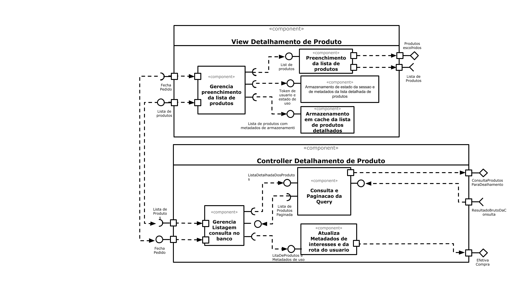

# Web como Plataforma e Subcomponentes
*Lab de Componentização e Reúso de Software 29/08/2020*

## Tarefa 1
> Escolha um conjunto de componentes do laboratório passado e os represente na forma de componentes com sub-comopnentes.

* O componente escolhido foi o de detalhamento de produto (View e Controller)

## Tarefa 2

> Crie uma conta no [Codepen](https://codepen.io/), copie o código do exemplo [React 03 - Componente Barra](https://codepen.io/santanche/pen/KKzmbwR) para a sua conta e construa um exemplo de componente adaptando o exemplo apresentado. Por se tratar de programação em JavaScript, podem ser feitas adaptações bastante simples.

## Os Componentes criados foram:
* **HTML**
~~~html

~~~

* **Javascript**
~~~JS
class Barra extends React.Component {
  render() {
    let resultado = "";
    for (let b = 1; b <= this.props.tamanho; b++)
      resultado += "=";
    return resultado;
  }
}

class Legalzometro extends React.Component {
  render() {
    let porcentagem_legal = this.props.sorte;
    let aleatorio = Math.floor((Math.random() * 1000) + 1);
    porcentagem_legal = (aleatorio) % 100;
    
    let dinossauro_choice = this.props.sorte % 3;
    let dinossauro_nome = "";

    switch(dinossauro_choice){
      case 0:
        dinossauro_nome = "Triceratopes";
        break;
      case 1:
        dinossauro_nome = "Tiranossauro Rex";
        break;
      default:
        dinossauro_nome = "Veloci Raptor";
    }
    
    
    return (
      

        Olá, {this.props.nome}!
        
 Voce eh {porcentagem_legal}% legal

        
 O Dinossauro designado para voce foi: {dinossauro_nome} 

      

    );
  }
}

const elemento = 

                   <h2>Legalzometro</h2>
                   <h4>E ai, voce eh legal ? </h4>
                   <h4>Quem sera seu dinossauro designado? </h4>
                   <Legalzometro nome="Johny" sorte="12"/>
                   
                 

ReactDOM.render(elemento, 
        document.getElementById("root"));

~~~